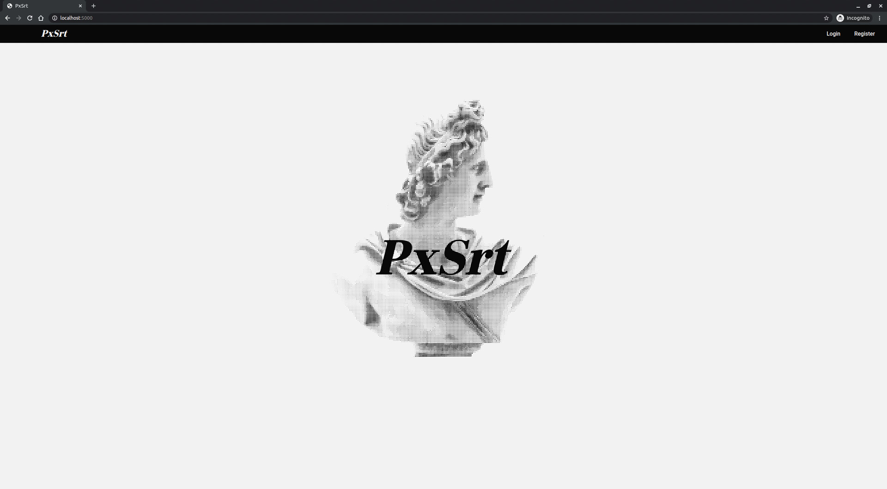
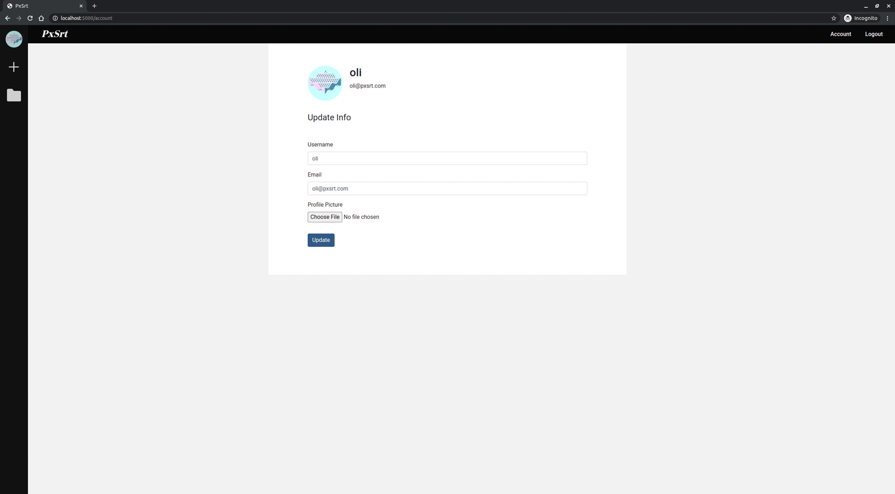
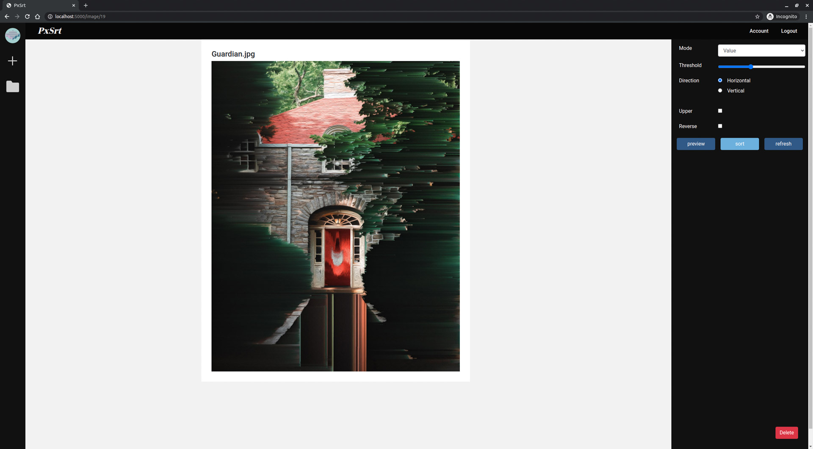
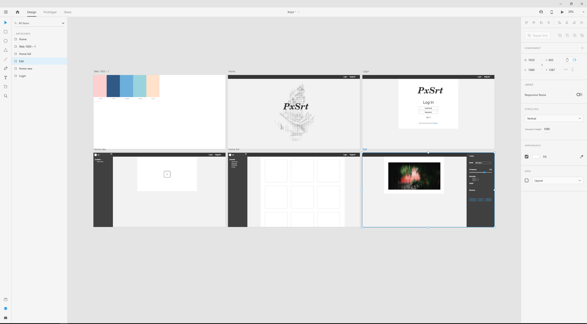

# PxSrt Web Application

## About
> PxSrt is an application that allows you to sort the pixels in an image of your choosing. 






## Setup (local)
### Step 1:
```
pip3 install -r requirements.txt
python3 src/run.py
```
### Step 2:
* Browse to localhost:5000 in your browser.

## Features

## Technologies
